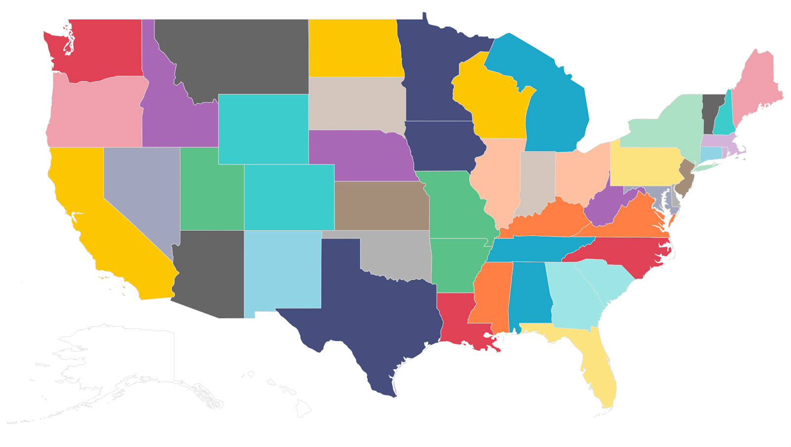

# Predicting Traffic Delays Using U.S. Congestion and Weather Data

> Team 26 – Big Data, Spring 2025

| Name                   | Role                   | Email                             |
| ---------------------- | ---------------------- | --------------------------------- |
| Alexey Tkachenko       | Data Engineer          | a.tkachenko@innopolis.university  |
| Daniil Abrosimov       | ML Specialist          | d.abrosimov@innopolis.university  |
| Egor Machnev           | Data Scientist         | e.machnev@innopolis.university    |
| Apollinaria Chernikova | Tester and Tech Writer | a.chernikova@innopolis.university |



<div align="center">

[Dashboard](http://hadoop-03.uni.innopolis.ru:8808/superset/dashboard/65/) •
[Slides](https://docs.google.com/presentation/d/1sM-ThdE7JnkxrupelgnWeVv8Ugl3S6E3jYg3owWLm5A/edit?usp=sharing)
• [Report](./REPORT.pdf) •
[Dataset](https://www.kaggle.com/datasets/sobhanmoosavi/us-traffic-congestions-2016-2022)

</div>

## About

Traffic congestion represents a persistent and growing challenge across the
United States, affecting millions of commuters on a daily basis. This phenomenon
leads to increased travel times, fuel consumption, and environmental costs,
while also introducing complexities into urban planning and logistics
operations.

The objective of this project is to develop a scalable, end-to-end data pipeline
that transforms raw traffic data into actionable insights using machine learning
and interactive visualization. To achieve this, we leverage the publicly
available
[US Traffic Congestion 2016–2022 dataset](https://www.kaggle.com/datasets/sobhanmoosavi/us-traffic-congestions-2016-2022),
which contains over **33 million** congestion records from **49 U.S. states**,
spanning the period from **February 2016 to September 2022**.

The project is guided by three fundamental goals:

1. **Construct a big data pipeline** capable of handling real-world scale,
   starting from raw CSV files and progressing through data storage,
   transformation, modeling, and presentation in an analytical dashboard.
2. **Address key applied questions**, such as:
   1. Which factors (e.g., weather, time of day, location) most influence the
      severity and duration of traffic delays?
   2. Can the duration of a traffic jam be predicted with reasonable accuracy in
      advance?
3. **Support decision-making** for urban planners, transportation authorities,
   and logistics companies by offering a clear, intuitive dashboard that
   highlights congestion hotspots, temporal patterns, and model-based delay
   forecasts.

Throughout the course of this project, we addressed a range of technical
challenges — including the management of missing data, engineering of temporal
and spatial features, and the complexity of developing distributed machine
learning models. The final system integrates **PostgreSQL**, **Hive**, **Spark
MLlib**, and **Apache Superset**, forming a dependable and extensible analytics
platform for both real-time and historical traffic congestion data.

Full details of our methodology, findings, and system architecture are available
in the [final report](./REPORT.pdf).

## Repository Overview

<table>
    <tr>
        <th>Path</th>
        <th>Description</th>
    </tr>
        <tr>
        <td><code><a href='output/'>output/</a></code></td>
        <td>Important output of our pipeline</td>
    </tr>
        <tr>
        <td><code><a href='scripts/'>scripts/</a></code></td>
        <td>Scripts that describe the pipeline</td>
    </tr>
    <tr>
        <td><code><a href='secrets/'>secrets/</a></code></td>
        <td>Folder with secrets and passwords</td>
    </tr>
    <tr>
        <td><code><a href='sql/'>sql/</a></code></td>
        <td>SQL & HQL queries</td>
    </tr>
        <tr>
        <td><code><a href='REPORT.pdf'>REPORT.pdf</a></code></td>
        <td>Report for this project</td>
    </tr>
    </tr>
        <tr>
        <td><code><a href='SLIDES.pdf'>SLIDES.pdf</a></code></td>
        <td>Presentation for this project</td>
    </tr>
    <tr>
        <td><code><a href='main.sh'>main.sh</a></code></td>
        <td>Staring point of the whole pipeline</td>
    </tr>
    <tr>
        <td><code><a href='requirements.txt'>requirements.txt</a></code></td>
        <td>Python dependencies</td>
    </tr>
</table>

## Usage

Clone the repository and run the pipeline:

```bash
git clone https://github.com/da-the-dev/big-data-final-project
cd big-data-final-project
bash main.sh
```
